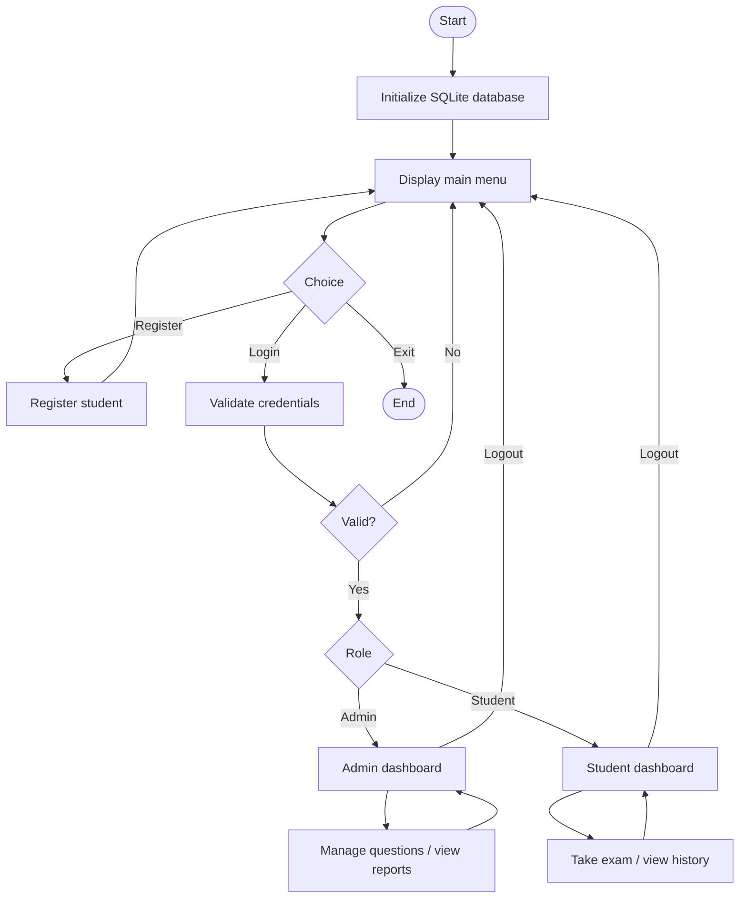
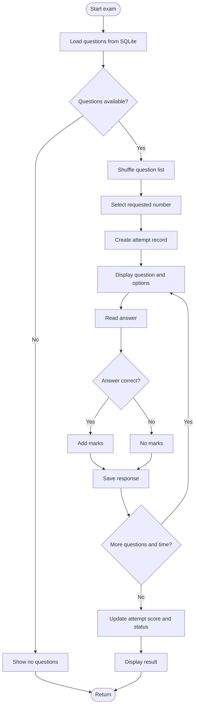

# Flowcharts

## Overall application

```mermaid
flowchart TD
    A([Start]) --> B[Initialize SQLite database]
    B --> C[Display main menu]
    C --> D{Choice}
    D -->|Register| E[Register student]
    E --> C
    D -->|Login| F[Validate credentials]
    F --> G{Valid?}
    G -->|No| C
    G -->|Yes| H{Role}
    H -->|Admin| I[Admin dashboard]
    H -->|Student| J[Student dashboard]
    I --> K[Manage questions / view reports]
    K --> I
    J --> L[Take exam / view history]
    L --> J
    I -->|Logout| C
    J -->|Logout| C
    D -->|Exit| M([End])
```

## Examination and evaluation

```mermaid
flowchart TD
    A([Start exam]) --> B[Load questions from SQLite]
    B --> C{Questions available?}
    C -->|No| D[Show no questions]
    D --> Z([Return])
    C -->|Yes| E[Shuffle question list]
    E --> F[Select requested number]
    F --> G[Create attempt record]
    G --> H[Display question and options]
    H --> I[Read answer]
    I --> J{Answer correct?}
    J -->|Yes| K[Add marks]
    J -->|No| L[No marks]
    K --> M[Save response]
    L --> M
    M --> N{More questions and time?}
    N -->|Yes| H
    N -->|No| O[Update attempt score and status]
    O --> P[Display result]
    P --> Z([Return])
```
